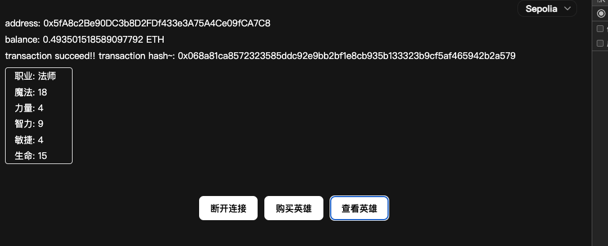

<h1 align="center">A NFT/GameFi Project</h1>

----

Tags: `hardhat` `web3-react` `ethers.js` `solidity` `alchemy` `typescript` `react` `react-native` `web3.js`

## Already Deployed On The Test Net ;) ;) ❗️❗️

5/12/2024 20:43 `GMT+0800`

I deployed this contract on the Sepolia test net today, wow, below is the contract address~~, you can call it in your own app~

0xE88c5417E2894cbe37D733913Ad82A5641a8c19D

a little bit excited, this is i buy my hero on my contract which on the Sepolia net.



## .env config
This is important! :)

Create `.env` file in the path `packages/contract`, and type these two accounts in it. this will init two test accounts in the hardhat test_net when you deploy your private chain.

Also, if you want to deploy your contract in the ethereum or alchemy, append your privatekey in this `.env` file.

```shell
ADDRESS=0xf39Fd6e51aad88F6F4ce6aB8827279cffFb92266 ## Change this address to your wallet account address when deploy on the alchemy
## Account #0: 0xf39Fd6e51aad88F6F4ce6aB8827279cffFb92266 (10000 ETH)
## Private Key: 0xac0974bec39a17e36ba4a6b4d238ff944bacb478cbed5efcae784d7bf4f2ff80
TEST_NET_ADDRESS=0xf39Fd6e51aad88F6F4ce6aB8827279cffFb92266
TEST_NET_PRIVATE_KEY=0xac0974bec39a17e36ba4a6b4d238ff944bacb478cbed5efcae784d7bf4f2ff80

## Account #1: 0x70997970C51812dc3A010C7d01b50e0d17dc79C8 (10000 ETH)
## Private Key: 0x59c6995e998f97a5a0044966f0945389dc9e86dae88c7a8412f4603b6b78690d

TEST_NET_ADDRESS2=0x70997970C51812dc3A010C7d01b50e0d17dc79C8
TEST_NET_PRIVATE_KEY2=0x59c6995e998f97a5a0044966f0945389dc9e86dae88c7a8412f4603b6b78690d
```

## deploy

- `pnpm install`
- `pnpm run node` 部署私链
- `pnpm run compile` 编译合约
- `pnpm run ignition` 部署合约
- `pnpm run web` 启动web前台
---
- `pnpm run test:c` 合约单元测试
- `pnpm run ignition_alchemy` 发布到测试链

以下是开发过程部分

## 项目架构[Project Content]
monorepo，合约和前台部分分离，web和移动端分离

- [x] 合约

web [In Progress]

mobile [ToDo]

## 合约部分

项目生成: `npx hardhat init`，创建typescript项目

### 创建英雄合约 ✅
规则： 
- 英雄种类3种 ✅
    Mage, Healer, Barbarian
- 英雄属性5个 ✅
    Strength, Health, Dexterity, Intellect, Magic
- 创建英雄规则 ✅
    价格：0.05 ETH，支付到founder账号,founder可以更改收款地址.
    属性生成，随机生成属性值，值在0 ~ 18，0 ~ 17...，0 ~ 13之间随机
    例如，第一次生成Health，值会在0 ~ 18之间随机，第二次生成Intellect，值会在0 ~ 17之间随机，and so on.
- 一个玩家可以创建多个英雄 ✅
    多个英雄保存在自己的账号地址里✅
- 英雄转移【不付费】 ✅
- 英雄命名/改名 TODO
- 属性综合排名 TODO

### 合约测试 ✅
`./test`文件夹下新建Hero.ts对应Hero.sol，创建一个TestHero.sol的合约来设置随机数

`npx hardhat test`

测试内容：

- 付费不够会失败报错 "Please send more money"。 ✅
- 支付成功随机创建了英雄的五个属性，这里随机数设置一个定值。 ✅
- 支付成功创建了一个英雄。✅
- 一个玩家可以拥有多个英雄。✅
- 购买英雄后转账到创建者账号。✅
- 创建者可以修改接受转账地址。✅
- 可以将英雄转移给别人✅

### 合约编译，部署
- 编译合约
`npx hardhat compile`，生成abi文件
- 部署合约【选择部署链，这里部署到本地链上】
1.本地创建链
新开一个控制台，执行`npx hardhat node`，会创建一个有10个账号地址的私链，初始会有10000ETH的金币。每次重新创建这个地址都相同，部署后，小狐狸钱包可以连接到部署的本地链上。用提供的私链地址在钱包里创建一个新的账号，。
2.部署合约
`npx hardhat ignition deploy ignition/modules/Hero.ts --network localhost` or `npm run ignition`，可以在链控制台上看到新部署的合约，再次部署先删掉ignition中的deployments文件

## 前台交互部分
前台子项目
`cd web-ui`
`pnpm install`

### 功能
- 购买英雄
- 查看英雄
- 查看英雄属性排名
- 英雄改名
- 英雄属性【五边形状态】
- 英雄转移【交换】

### 前台合约交互
- 连接metamask
- 切换链
- 选择账号
- 往metamask添加新网络：EIP-3085


1.web端
2.移动端 ToDo

## Developing Recording

### Error Type
Received invalid block tag **. Latest block number is **

this is a MetaMask Error, when you redeploy a contract in the local. disconnect the wallet to the front end project, change the chain, refresh the page. reload the vite project. try any thing you can to refresh the environment of your wallet, like reboot your computer in early age when your system meet some error ;).

nonce too high...

this is a MetaMask Error also. refresh the nonce data in the setting of the MetaMask.

### TodoList
- todo：替换支付等交互模块web3-react->web3.js✅
- todo：重写切换select组件✅
- todo：切换MetaMask链（切换网络）✅
- todo：初次进入页面链接钱包（缓存到浏览器）✅
- todo：处理主题配置没生效✅
- todo：使用事件监听重写balance模块，改成购买后通过emit事件更新balance✅
- todo：英雄可以转让✅
- todo：alchemy上部署链✅
- todo：在本地项目里访问测试链创建英雄✅
- todo：怎么查看部署合约的地址（除了log以外）✅（abi里有记录，合约交易里有记录）
- todo：bug，当初次链接账号时，页面内容没有响应，没有更新
- todo：开发环境合约地址跟随链切换

## Log
2024/5/9
- 添加创建英雄付款到创始人账号合约功能
- 添加转账合约单测
- update package dependencies, fix type errors
- 前台用web3-react替换了部分之前用web3.js链接钱包的模块

2024/5/10
- 用@ethersproject和web3react重构合约交互逻辑
- 重写前端购买英雄模块
- 重写前端获取英雄模块

2024/5/11
- 重写selector和button组件
- 使用styled-components，配置全局样式（theme的darkMode还有bug）
- 添加错误输出模块
- 初次进入页面链接钱包
- 解决切换链后信息不同步问题
- 解决主题显示不生效问题
- 合约：英雄转移
- 合约：费用计算表格
- 合约：英雄转移添加emit事件

2024/5/12
- 领取sepolia空投（每天0.5ETH），在alchemy上部署合约
- alchemy链id:11155111，RPC URL:https://sepolia.infura.io/v3/
- 部署在测试网需要的3个东西

    - 选择sepolia网络，network选择ethereum，创建一个project，得到api_key和访问的RPC_URL
    - 进入sepolia测试网络，领取空投后，在自己钱包里面选择账号，需要钱包账号的PRIVATE_KEY
    - 钱包账号的ADDRESS

- 合约部署后，ignition会log合约地址，把这个保存下来
- 添加sepolia网
- 链接sepolia网创建英雄

2024/5/13
- 使用EIP-3085在链没有连接钱包时创建链